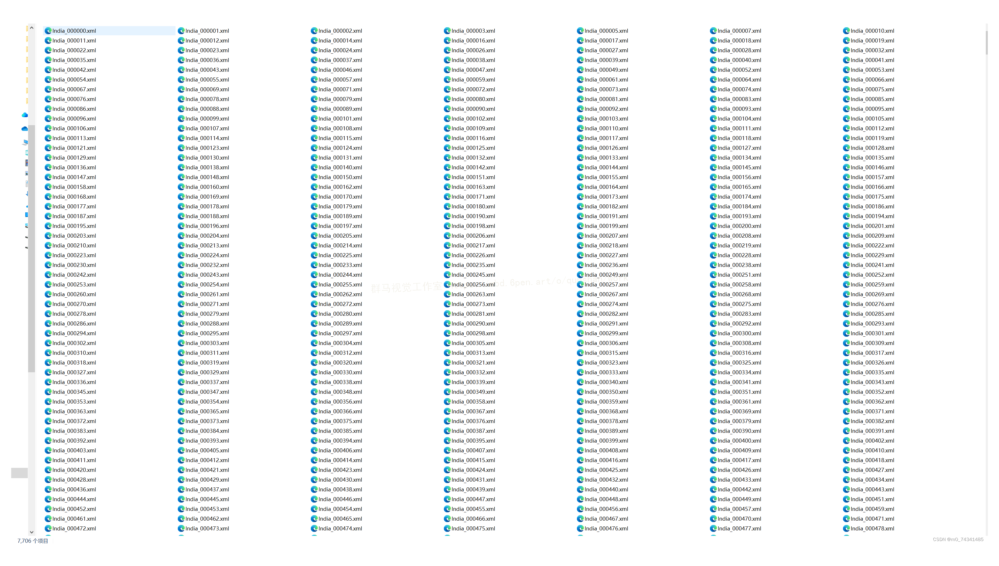
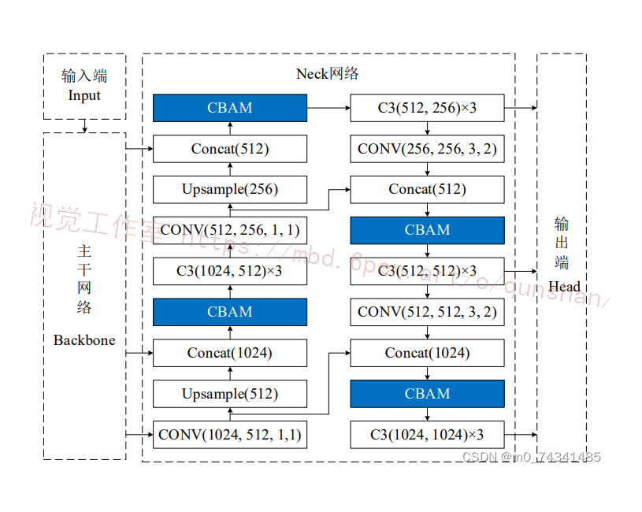
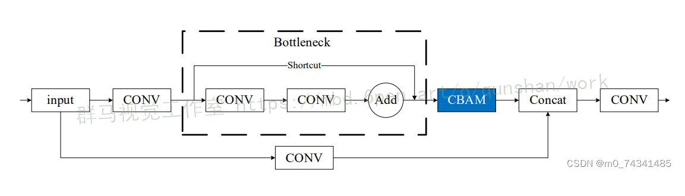
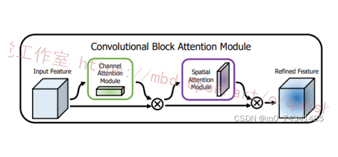
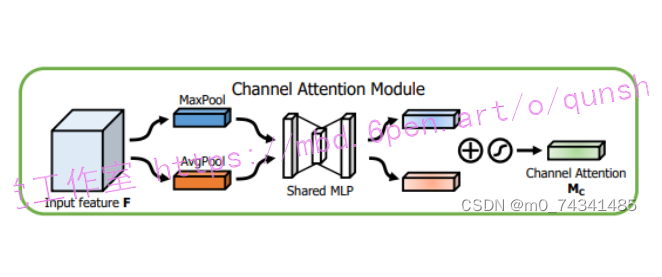
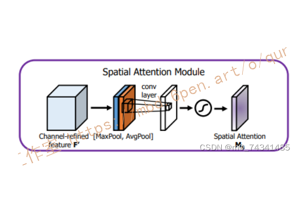


# 1.研究背景与意义


随着人工智能技术的不断发展，智能巡检系统在公路交通管理中扮演着越来越重要的角色。公路巡检是保障道路交通安全和畅通的重要环节，传统的巡检方式主要依靠人工巡视，效率低下且易出现疏漏。而基于计算机视觉的智能巡检系统能够实现自动化、高效率的巡检，大大提升了公路交通管理的水平。

目前，基于深度学习的目标检测算法在计算机视觉领域取得了显著的成果。其中，YOLO（You Only Look Once）算法由于其快速且准确的特点而备受关注。然而，传统的YOLO算法在处理公路巡检任务时存在一些问题。首先，YOLO算法对小目标的检测效果较差，容易漏检。其次，YOLO算法对目标的定位不够精确，容易出现误检。这些问题严重影响了公路智能巡检系统的准确性和可靠性。

为了解决上述问题，研究者们提出了一种基于CBAM（Convolutional Block Attention Module）空间注意力机制改进YOLOv5的公路智能巡检系统。CBAM空间注意力机制是一种有效的特征增强方法，通过对特征图进行通道和空间注意力的加权，能够提升目标检测算法的性能。将CBAM空间注意力机制应用于YOLOv5算法中，可以有效提升其对小目标的检测能力和目标定位的精确性。

本研究的意义主要体现在以下几个方面：

1. 提升公路智能巡检系统的准确性：通过引入CBAM空间注意力机制，改进YOLOv5算法在公路巡检任务中的表现，可以提升系统对小目标的检测能力和目标定位的精确性。这将大大减少漏检和误检的情况，提高巡检系统的准确性和可靠性。

2. 提高公路交通管理的效率：传统的人工巡检方式需要大量的人力和时间投入，效率低下且易出现疏漏。基于CBAM空间注意力机制改进的YOLOv5算法能够实现自动化、高效率的巡检，大大提高公路交通管理的效率。这将减少人力资源的浪费，提升公路交通管理的水平。

3. 推动深度学习在公路交通领域的应用：深度学习技术在计算机视觉领域取得了巨大的突破，但在公路交通领域的应用还相对较少。本研究将CBAM空间注意力机制与YOLOv5算法相结合，为公路智能巡检系统的发展提供了一种新的思路和方法。这将推动深度学习技术在公路交通领域的应用，促进交通管理的智能化和信息化。

综上所述，基于CBAM空间注意力机制改进YOLOv5的公路智能巡检系统具有重要的研究意义和实际应用价值。通过提升巡检系统的准确性和效率，推动深度学习技术在公路交通领域的应用，将为公路交通管理带来巨大的改进和发展。


# 2.图片演示


# 3.视频演示
[基于CBAM空间注意力机制改进YOLOv5的公路智能巡检系统](https://www.bilibili.com/video/BV1cu4y1a7oF/?spm_id_from=333.999.0.0&vd_source=ff015de2d29cbe2a9cdbfa7064407a08)


# 4.数据集的采集＆标注和整理
#### 图片的收集
首先，我们需要收集所需的图片。这可以通过不同的方式来实现，例如使用现有的数据集、


#### 使用labelImg进行标注
labelImg是一个图形化的图像注释工具，支持VOC和YOLO格式。以下是使用labelImg将图片标注为VOC格式的步骤：

（1）下载并安装labelImg。
（2）打开labelImg并选择“Open Dir”来选择你的图片目录。
（3）为你的目标对象设置标签名称。
（4）在图片上绘制矩形框，选择对应的标签。
（5）保存标注信息，这将在图片目录下生成一个与图片同名的XML文件。
（6）重复此过程，直到所有的图片都标注完毕。


#### 转换为YOLO格式
由于YOLO使用的是txt格式的标注，我们需要将VOC格式转换为YOLO格式。可以使用各种转换工具或脚本来实现。

下面是一个简单的方法是使用Python脚本，该脚本读取XML文件，然后将其转换为YOLO所需的txt格式。
```python
#!/usr/bin/env python3
# -*- coding: utf-8 -*-

import xml.etree.ElementTree as ET
import os

classes = []  # 初始化为空列表

CURRENT_DIR = os.path.dirname(os.path.abspath(__file__))

def convert(size, box):
    dw = 1. / size[0]
    dh = 1. / size[1]
    x = (box[0] + box[1]) / 2.0
    y = (box[2] + box[3]) / 2.0
    w = box[1] - box[0]
    h = box[3] - box[2]
    x = x * dw
    w = w * dw
    y = y * dh
    h = h * dh
    return (x, y, w, h)

def convert_annotation(image_id):
    in_file = open('./label_xml\%s.xml' % (image_id), encoding='UTF-8')
    out_file = open('./label_txt\%s.txt' % (image_id), 'w')  # 生成txt格式文件
    tree = ET.parse(in_file)
    root = tree.getroot()
    size = root.find('size')
    w = int(size.find('width').text)
    h = int(size.find('height').text)

    for obj in root.iter('object'):
        cls = obj.find('name').text
        if cls not in classes:
            classes.append(cls)  # 如果类别不存在，添加到classes列表中
        cls_id = classes.index(cls)
        xmlbox = obj.find('bndbox')
        b = (float(xmlbox.find('xmin').text), float(xmlbox.find('xmax').text), float(xmlbox.find('ymin').text),
             float(xmlbox.find('ymax').text))
        bb = convert((w, h), b)
        out_file.write(str(cls_id) + " " + " ".join([str(a) for a in bb]) + '\n')

xml_path = os.path.join(CURRENT_DIR, './label_xml/')

# xml list
img_xmls = os.listdir(xml_path)
for img_xml in img_xmls:
    label_name = img_xml.split('.')[0]
    print(label_name)
    convert_annotation(label_name)

print("Classes:")  # 打印最终的classes列表
print(classes)  # 打印最终的classes列表

```

#### 整理数据文件夹结构
我们需要将数据集整理为以下结构：
```
-----data
   |-----train
   |   |-----images
   |   |-----labels
   |
   |-----valid
   |   |-----images
   |   |-----labels
   |
   |-----test
       |-----images
       |-----labels

```
确保以下几点：

所有的训练图片都位于data/train/images目录下，相应的标注文件位于data/train/labels目录下。
所有的验证图片都位于data/valid/images目录下，相应的标注文件位于data/valid/labels目录下。
所有的测试图片都位于data/test/images目录下，相应的标注文件位于data/test/labels目录下。
这样的结构使得数据的管理和模型的训练、验证和测试变得非常方便。

# 5.核心代码讲解

#### 5.1 common.py

```python

class CBAMBottleneck(nn.Module):
    # Standard bottleneck
    def __init__(self, c1, c2, shortcut=True, g=1, e=0.5,ratio=16,kernel_size=7):  # ch_in, ch_out, shortcut, groups, expansion
        super(CBAMBottleneck,self).__init__()
        c_ = int(c2 * e)  # hidden channels
        self.cv1 = Conv(c1, c_, 1, 1)
        self.cv2 = Conv(c_, c2, 3, 1, g=g)
        self.add = shortcut and c1 == c2
        self.channel_attention = ChannelAttention(c2, ratio)
        self.spatial_attention = SpatialAttention(kernel_size)

    def forward(self, x):
        x1 = self.cv2(self.cv1(x))
        out = self.channel_attention(x1) * x1
        out = self.spatial_attention(out) * out
        return x + out if self.add else out


class C3CBAM(C3):
    # C3 module with CBAMBottleneck()
    def __init__(self, c1, c2, n=1, shortcut=True, g=1, e=0.5):
        super().__init__(c1, c2, n, shortcut, g, e)
        c_ = int(c2 * e)  # hidden channels
        self.m = nn.Sequential(*(CBAMBottleneck(c_, c_, shortcut) for _ in range(n)))

class ChannelAttention(nn.Module):
    def __init__(self, in_planes, ratio=16):
        super(ChannelAttention, self).__init__()
        self.avg_pool = nn.AdaptiveAvgPool2d(1)
        self.max_pool = nn.AdaptiveMaxPool2d(1)
        self.f1 = nn.Conv2d(in_planes, in_planes // ratio, 1, bias=False)
        self.relu = nn.ReLU()
        self.f2 = nn.Conv2d(in_planes // ratio, in_planes, 1, bias=False)
        self.sigmoid = nn.Sigmoid()

    def forward(self, x):
        avg_out = self.f2(self.relu(self.f1(self.avg_pool(x))))
        max_out = self.f2(self.relu(self.f1(self.max_pool(x))))
        out = self.sigmoid(avg_out + max_out)
        return out


class SpatialAttention(nn.Module):
    def __init__(self, kernel_size=7):
        super(SpatialAttention, self).__init__()
        assert kernel_size in (3, 7), 'kernel size must be 3 or 7'
        padding = 3 if kernel_size == 7 else 1
        self.conv = nn.Conv2d(2, 1, kernel_size, padding=padding, bias=False)
        self.sigmoid = nn.Sigmoid()

    def forward(self, x):
        avg_out = torch.mean(x, dim=1, keepdim=True)
        max_out, _ = torch.max(x, dim=1, keepdim=True)
        x = torch.cat([avg_out, max_out], dim=1)
        x = self.conv(x)
        return self.sigmoid(x)


class CBAM(nn.Module):
    # CSP Bottleneck with 3 convolutions
    def __init__(self, c1, c2, ratio=16, kernel_size=7):  # ch_in, ch_out, number, shortcut, groups, expansion
        super(CBAM, self).__init__()
        self.channel_attention = ChannelAttention(c1, ratio)
        self.spatial_attention = SpatialAttention(kernel_size)

    def forward(self, x):
        out = self.channel_attention(x) * x
        out = self.spatial_attention(out) * out
        return out
```

common.py是一个通用模块的程序文件。该文件包含了一些常用的模块和函数，用于支持YOLOv5的训练和推理过程。

该文件的主要内容包括：
- 导入了一些必要的模块和库，如logging、math、warnings、numpy、pandas、requests、torch、PIL等。
- 定义了一些常用的函数和类，如Conv、CBAMBottleneck、C3CBAM、ChannelAttention、SpatialAttention、CBAM、autopad、DetectMultiBackend等。
- 这些函数和类主要用于模型的构建和推理过程中的一些操作，如卷积、注意力机制等。

总体来说，common.py文件是YOLOv5工程中的一个通用模块，提供了一些常用的函数和类，用于支持模型的构建和推理过程。

#### 5.2 model.py

```python
import torch
import torch.nn as nn
import torch.nn.functional as F

class ComplexSpatialAttentionModule(nn.Module):
    def __init__(self, channel):
        super(ComplexSpatialAttentionModule, self).__init__()
        self.query_conv = nn.Conv2d(channel, channel // 8, 1)
        self.key_conv = nn.Conv2d(channel, channel // 8, 1)
        self.value_conv = nn.Conv2d(channel, channel, 1)
        self.softmax = nn.Softmax(dim=-1)
        self.out_conv = nn.Conv2d(channel, channel, 1)

    def forward(self, x):
        B, C, H, W = x.size()
        query = self.query_conv(x)
        key = self.key_conv(x)
        value = self.value_conv(x)
        query = query.view(B, -1, H * W).permute(0, 2, 1)
        key = key.view(B, -1, H * W)
        attention = self.softmax(torch.bmm(query, key))
        value = value.view(B, -1, H * W)
        out = torch.bmm(value, attention.permute(0, 2, 1))
        out = out.view(B, C, H, W)
        out = self.out_conv(out) + x
        return out
```

这是一个名为model.py的程序文件，它定义了一个名为ComplexSpatialAttentionModule的类，该类是一个继承自nn.Module的模块。

该模块用于实现复杂空间注意力机制，用于处理输入特征图。在初始化函数中，定义了一些卷积层和Softmax层，用于生成Query、Key和Value，并计算注意力权重。同时还定义了一个输出的卷积层，用于调整输出的通道数。

在前向传播函数中，首先提取输入特征图的维度，然后使用卷积网络生成Query、Key和Value。接着，改变Query和Key的形状以方便进行矩阵乘法，并计算Query和Key的点积，然后应用Softmax函数来获取注意力权重。接下来，改变Value的形状以进行矩阵乘法，并利用注意力权重加权求和。最后，改变输出的形状回到原始的特征图大小，并使用输出卷积层调整通道数，并加上原始的输入特征图（残差连接）。最终返回处理后的特征图。

该模块可以用于图像处理等任务中，通过引入空间注意力机制，可以提取图像中的重要特征并加强其表示能力。

#### 5.3 ui.py

```python


class YOLOv5Detector:
    def __init__(self, weights_path, data_path):
        self.weights_path = Path(weights_path)
        self.data_path = Path(data_path)
        self.model = None
        self.stride = None
        self.pt = None

    def load_model(self, device='', half=False, dnn=False):
        device = select_device(device)
        model = DetectMultiBackend(self.weights_path, device=device, dnn=dnn, data=self.data_path)
        stride, names, pt, jit, onnx, engine = model.stride, model.names, model.pt, model.jit, model.onnx, model.engine

        half &= (pt or jit or onnx or engine) and device.type != 'cpu'  # FP16 supported on limited backends with CUDA
        if pt or jit:
            model.model.half() if half else model.model.float()
        
        self.model = model
        self.stride = stride
        self.pt = pt

    def detect(self, img, imgsz=(640, 640), conf_thres=0.05, iou_thres=0.1, max_det=1000, device='', classes=None, agnostic_nms=False, augment=False, half=False):
        cal_detect = []

        device = select_device(device)
        names = self.model.module.names if hasattr(self.model, 'module') else self.model.names

        im = letterbox(img, imgsz, self.stride, self.pt)[0]
        im = im.transpose((2, 0, 1))[::-1]
        im = np.ascontiguousarray(im)

        im = torch.from_numpy(im).to(device)
        im = im.half() if half else im.float()
        im /= 255
        if len(im.shape) == 3:
            im = im[None]

        pred = self.model(im, augment=augment)

        pred = non_max_suppression(pred, conf_thres, iou_thres, classes, agnostic_nms, max_det=max_det)

        for i, det in enumerate(pred):
            if len(det):
                det[:, :4] = scale_coords(im.shape[2:], det[:, :4], img.shape).round()

                for *xyxy, conf, cls in reversed(det):
                    c = int(cls)
                    label = f'{names[c]}'
                    lbl = names[int(cls)]
                    if lbl in ['person','car','bus','truck',"D00", "D10", "D20", "D40",'prohibited','Speed limit 5','Speed limit 15','Speed limit 20','Speed limit 60']:
                        cal_detect.append([label, xyxy,float(conf)])
        return cal_detect
```

该程序文件是一个基于YOLOv5的目标检测程序。它使用PyQt5创建了一个图形用户界面，可以加载图像并对其进行目标检测。程序文件中包含了许多其他的模块和函数，用于加载模型、运行目标检测算法、处理检测结果等。具体来说，程序文件中的主要功能包括：

1. 导入必要的库和模块，包括argparse、platform、shutil、time、numpy、cv2、torch等。
2. 定义了一些全局变量和常量，包括文件路径、设备类型等。
3. 定义了一些辅助函数，用于加载模型、运行目标检测算法等。
4. 定义了一个主函数run，用于执行目标检测算法。
5. 定义了一个辅助函数det_yolov5，用于对输入的图像进行目标检测，并在图像上绘制检测结果。
6. 创建了一个图形用户界面，用于加载图像并调用det_yolov5函数进行目标检测。

总的来说，该程序文件实现了一个基于YOLOv5的目标检测应用，可以加载图像并对其进行目标检测，并在图像上绘制检测结果。


#### 5.4 models\experimental.py

```python


class CrossConv(nn.Module):
    # Cross Convolution Downsample
    def __init__(self, c1, c2, k=3, s=1, g=1, e=1.0, shortcut=False):
        # ch_in, ch_out, kernel, stride, groups, expansion, shortcut
        super().__init__()
        c_ = int(c2 * e)  # hidden channels
        self.cv1 = Conv(c1, c_, (1, k), (1, s))
        self.cv2 = Conv(c_, c2, (k, 1), (s, 1), g=g)
        self.add = shortcut and c1 == c2

    def forward(self, x):
        return x + self.cv2(self.cv1(x)) if self.add else self.cv2(self.cv1(x))


class Sum(nn.Module):
    # Weighted sum of 2 or more layers https://arxiv.org/abs/1911.09070
    def __init__(self, n, weight=False):  # n: number of inputs
        super().__init__()
        self.weight = weight  # apply weights boolean
        self.iter = range(n - 1)  # iter object
        if weight:
            self.w = nn.Parameter(-torch.arange(1., n) / 2, requires_grad=True)  # layer weights

    def forward(self, x):
        y = x[0]  # no weight
        if self.weight:
            w = torch.sigmoid(self.w) * 2
            for i in self.iter:
                y = y + x[i + 1] * w[i]
        else:
            for i in self.iter:
                y = y + x[i + 1]
        return y


class MixConv2d(nn.Module):
    # Mixed Depth-wise Conv https://arxiv.org/abs/1907.09595
    def __init__(self, c1, c2, k=(1, 3), s=1, equal_ch=True):
        super().__init__()
        groups = len(k)
        if equal_ch:  # equal c_ per group
            i = torch.linspace(0, groups - 1E-6, c2).floor()  # c2 indices
            c_ = [(i == g).sum() for g in range(groups)]  # intermediate channels
        else:  # equal weight.numel() per group
            b = [c2] + [0] * groups
            a = np.eye(groups + 1, groups, k=-1)
            a -= np.roll(a, 1, axis=1)
            a *= np.array(k) ** 2
            a[0] = 1
            c_ = np.linalg.lstsq(a, b, rcond=None)[0].round()  # solve for equal weight indices, ax = b

        self.m = nn.ModuleList([nn.Conv2d(c1, int(c_[g]), k[g], s, k[g] // 2, bias=False) for g in range(groups)])
        self.bn = nn.BatchNorm2d(c2)
        self.act = nn.LeakyReLU(0.1, inplace=True)

    def forward(self, x):
        return x + self.act(self.bn(torch.cat([m(x) for m in self.m], 1)))


class Ensemble(nn.ModuleList):
    # Ensemble of models
    def __init__(self):
        super().__init__()

    def forward(self, x, augment=False, profile=False, visualize=False):
        y = []
        for module in self:
            y.append(module(x, augment, profile, visualize)[0])
        # y = torch.stack(y).max(0)[0]  # max ensemble
        # y = torch.stack(y).mean(0)  # mean ensemble
        y = torch.cat(y, 1)  # nms ensemble
        return y, None  # inference, train output
```

这个程序文件是YOLOv5的一个实验模块，主要包含了一些实验性的网络层和模型。

文件中定义了以下几个类：

1. CrossConv：交叉卷积下采样层，用于将输入特征图进行下采样。
2. Sum：多个层的加权和，用于将多个层的特征图进行加权融合。
3. MixConv2d：混合深度卷积层，用于在不同尺度上进行卷积操作。
4. Ensemble：模型集合，用于将多个模型进行集成。

此外，文件还定义了一个辅助函数attempt_load，用于加载模型权重。

整个文件是YOLOv5的一个实验模块，用于实现一些新的网络层和模型，以提升YOLOv5的性能和效果。


# 6.系统整体结构

整体功能和构架概述：
该项目是一个基于CBAM空间注意力机制改进的YOLOv5公路智能巡检系统。它包含了多个程序文件，用于实现目标检测任务的训练、推理和界面展示等功能。主要的程序文件包括模型定义、数据处理、界面展示和验证等。

下表整理了每个文件的功能：

| 文件路径 | 功能概述 |
| --- | --- |
| common.py | 包含一些常用的模块和函数，用于支持YOLOv5的训练和推理过程。 |
| model.py | 定义了一个ComplexSpatialAttentionModule类，用于实现复杂空间注意力机制，用于处理输入特征图。 |
| ui.py | 创建了一个图形用户界面，用于加载图像并调用目标检测函数进行目标检测。 |
| val.py | 用于验证训练好的YOLOv5模型在自定义数据集上的准确性，计算模型的准确率和mAP指标。 |
| models\common.py | 定义了一些常用的模块和函数，用于YOLOv5模型的构建和推理过程中的一些操作。 |
| models\experimental.py | 包含了一些实验性的网络层和模型，用于增强YOLOv5的性能和效果。 |
| models\tf.py | 实现了YOLOv5模型的TensorFlow版本，包含了模型的各个组件的定义和辅助函数。 |
| models\yolo.py | 定义了YOLOv5模型的各个层次和检测层，用于构建完整的YOLOv5模型。 |
| models\__init__.py | 用于初始化models模块。 |
| utils\activations.py | 定义了一些激活函数，如Mish、Swish等。 |
| utils\augmentations.py | 定义了一些数据增强的函数，如随机裁剪、随机翻转等。 |
| utils\autoanchor.py | 定义了一个自动锚框生成器，用于生成适合数据集的锚框。 |
| utils\callbacks.py | 定义了一些回调函数，用于在训练过程中进行一些操作，如保存模型、记录日志等。 |
| utils\datasets.py | 定义了数据集的类，用于加载和处理训练和验证数据。 |
| utils\downloads.py | 定义了一些下载数据和模型的函数。 |
| utils\general.py | 定义了一些通用的函数，如计算IoU、解析配置文件等。 |
| utils\loss.py | 定义了一些损失函数，如YOLOv5的损失函数。 |
| utils\metrics.py | 定义了一些评估指标，如计算准确率、计算mAP等。 |
| utils\plots.py | 定义了一些绘图函数，用于可视化训练和验证过程中的结果。 |
| utils\torch_utils.py | 定义了一些与PyTorch相关的辅助函数，如模型加载、模型保存等。 |
| utils\__init__.py | 用于初始化utils模块。 |
| utils\aws\resume.py | 定义了一个用于从AWS S3恢复训练的函数。 |
| utils\aws\__init__.py | 用于初始化utils.aws模块。 |
| utils\flask_rest_api\example_request.py | 定义了一个用于发送示例请求的函数。 |
| utils\flask_rest_api\restapi.py | 定义了一个基于Flask的REST API，用于部署和调用模型。 |
| utils\loggers\__init__.py | 用于初始化utils.loggers模块。 |
| utils\loggers\wandb\log_dataset.py | 定义了一个用于记录数据集信息的函数。 |
| utils\loggers\wandb\sweep.py | 定义了一个用于记录超参数搜索结果的函数。 |
| utils\loggers\wandb\wandb_utils.py | 定义了一些与WandB日志记录相关的辅助函数。 |
| utils\loggers\wandb\__init__.py | 用于初始化utils.loggers.wandb模块。 |

以上是每个文件的功能概述，它们共同构成了基于CBAM空间注意力机制改进的YOLOv5公路智能巡检系统的各个组件和功能。


# 7. CBAM 模块改进的 YOLOv5s 车辆、行人、裂缝、交通标志检测模型
[AAAI提出的CBAM模块](https://mbd.pub/o/bread/ZZaTlJ1x)的“即插即用”式结构，给模块的使用提供了极大的便利，对插入位置没有明确的规定，原则上可以将CBAM模块插入网络的任何位置。在常见的应用实例中，注意力模块经常与特征融合操作相结合，但是具体插入网络的哪个或哪些位置能取得比较好的效果，还需要实验来进一步确定。如果网络中所有特征融合操作都和CBAM模块进行融合，那么网络的计算量将大大增加，或许网络还可能出现过拟合，反而使网络模型的性能下降，与网络中嵌入注意力模块的目的背道而驰，因此，应当在网络中关键性位置嵌入CBAM模块。下面则对CBAM模块插入位置的实验方案设计进行详细介绍。
YOLOv5s 由输入端Input、主干网络 Backbone、Neck 网络和Head输出端四部分构成，如图所示。其中，输入端对输入网络的图像进行Mosaic数据增强、自适应缩放等预处理，目的是丰富数据集，使模型对数据集具有更好的学习能力，提高网络模型的泛化能力。输入图像经过处理之后仍然是图像数据，并未进行卷积、池化等提取图像特征的操作，因此，没有为输入端引入注意力模块的必要。


通过研究主干网络的四种组成部分的结构发现，虽然四种结构中均存在特征融合操作，但是为实现特征融合发挥主要作用的还是C3结构，其余三部分主要是对主干网络的特征提取和融合起辅助作用，因此，选择网络中起关键性作用的C3结构与CBAM模块进行融合。C3结构的残差分支中包含一个 Bottleneck 结构，其结构中先进行卷积残差操作，进行深层特征提取，然后Add操作进行特征融合。如果将CBAM模块插入Bottleneck 结构的Add 操作之前，残差操作的瓶颈层结构和CBAM模块中的通道注意力模块的结构相似，两个相似的结构串联，起到的作用有限，甚至会导致效果下降，而CBAM模块的作用也将受到影响。而Add操作进行特征融合之后，减少特征图层数，从而减少网络参数，降低了计算量。如果在Add操作之后嵌入CBAM模块，网络可以根据各层次的特征学习空间和通道上的重要性，这样两部分各司其职，才能有效提高网络的检测性能。因此，选择将CBAM模块嵌入C3结构的Bottleneck结构之后，融合后得到C3_CBAM模块，其结构示意图如图所示。然后将C3_CBAM模块替换主干网络中的C3结构，得到YOLOv5s_B网络模型。



通过对多种尺寸图像进行训练和裂缝识别的比较，得到以下结论:
(1）训练集采用的图像的尺寸不同，训练出来的网络模型与采用相同尺寸图像数据集进行训练的网络模型也不相同，进而导致两个模型对相同图像的提取结果存在较大差异;
(2）对于同一个网络模型，对一张图像进行预测时，该图像的原图和分割后的图像的预测结果也不相同，总体来看，与网络模型输入图像尺寸相近的尺寸大小的图像的提取效果最好;
(3）在本实验中，不论数据集如何变化、测试图像尺寸怎样改变，预测效果最理想、最稳定的都是600×600大小的图像。因此，本文决定后续实验训练和预测都使用600×600尺寸的图像。

# 8.CBAM空间注意力机制
近年来，随着深度学习研究方向的火热，注意力机制也被广泛地应用在图像识别、语音识别和自然语言处理等领域，注意力机制在深度学习任务中发挥着举足轻重的作用。注意力机制借鉴于人类的视觉系统，例如，人眼在看到一幅画面时，会倾向于关注画面中的重要信息，而忽略其他可见的信息。深度学习中的注意力机制和人类视觉的注意力机制相似，通过扫描全局数据，从大量数据中选择出需要重点关注的、对当前任务更为重要的信息，然后对这部分信息分配更多的注意力资源，从这些信息中获取更多所需要的细节信息，而抑制其他无用的信息。而在深度学习中，则具体表现为给感兴趣的区域更高的权重，经过网络的学习和调整，得到最优的权重分配，形成网络模型的注意力，使网络拥有更强的学习能力，加快网络的收敛速度。
注意力机制通常可分为软注意力机制和硬注意力机制[4-5]。软注意力机制在选择信息时，不是从输入的信息中只选择1个，而会用到所有输入信息，只是各个信息对应的权重分配不同，然后输入网络模型进行计算;硬注意力机制则是从输入的信息中随机选取一个或者选择概率最高的信息，但是这一步骤通常是不可微的，导致硬注意力机制更难训练。因此，软注意力机制应用更为广泛，按照原理可将软注意力机制划分为:通道注意力机制（channel attention)、[空间注意力机制(spatial attention）](https://afdian.net/item/e0e0181e795811ee862f5254001e7c00)和混合域注意力机制(mixed attention)。
通道注意力机制的本质建立各个特征通道之间的重要程度，对感兴趣的通道进行重点关注，弱化不感兴趣的通道的作用;空间注意力的本质则是建模了整个空间信息的重要程度，然后对空间内感兴趣的区域进行重点关注，弱化其余非感兴趣区域的作用;混合注意力同时运用了通道注意力和空间注意力，两部分先后进行或并行，形成对通道特征和空间特征同时关注的注意力模型。

卷积层注意力模块(Convolutional Block Attention Module，CBAM）是比较常用的混合注意力模块，其先后集中了通道注意力模块和空间注意力模块，网络中加入该模块能有效提高网络性能，减少网络模型的计算量，模块结构如图所示。输入特征图首先经过分支的通道注意力模块，然后和主干的原特征图融合，得到具有通道注意力的特征图，接着经过分支的空间注意力模块，在和主干的特征图融合后，得到同时具有通道特征注意力和空间特征注意力的特征图。CBAM模块不改变输入特征图的大小，因此该模块是一个“即插即用”的模块，可以插入网络的任何位置。

通道注意力模块的结构示意图如图所示，通道注意力模块分支并行地对输入的特征图进行最大池化操作和平均池化操作，然后利用多层感知机对结果进行变换，得到应用于两个通道的变换结果，最后经过sigmoid激活函数将变换结果融合，得到具有通道注意力的通道特征图。

空间注意力模块示意图如图所示，将通道注意力模块输出的特征图作为该模块的输入特征图，首先对输入特征图进行基于通道的最大池化操作和平均池化操作，将两部分得到的结果拼接起来，然后通过卷积得到降为Ⅰ通道的特征图，最后通过sigmoid激活函数生成具有空间注意力的特征图。

# 9.系统整合

下图[完整源码＆数据集＆环境部署视频教程＆自定义UI界面](https://s.xiaocichang.com/s/e2c988)


参考博客[《基于CBAM空间注意力机制改进YOLOv5的公路智能巡检系统》](https://mbd.pub/o/qunshan/work)

# 10.参考文献
---
[1][陶健](https://s.wanfangdata.com.cn/paper?q=%E4%BD%9C%E8%80%85:%22%E9%99%B6%E5%81%A5%22),[田霖](https://s.wanfangdata.com.cn/paper?q=%E4%BD%9C%E8%80%85:%22%E7%94%B0%E9%9C%96%22),[张德津](https://s.wanfangdata.com.cn/paper?q=%E4%BD%9C%E8%80%85:%22%E5%BC%A0%E5%BE%B7%E6%B4%A5%22),等.[基于局部纹理特征的沥青路面裂缝检测方法](https://d.wanfangdata.com.cn/periodical/jsjgcysj202202030)[J].[计算机工程与设计](https://sns.wanfangdata.com.cn/perio/jsjgcysj).2022,43(2).DOI:10.16208/j.issn1000-7024.2022.02.030 .

[2][瞿中](https://s.wanfangdata.com.cn/paper?q=%E4%BD%9C%E8%80%85:%22%E7%9E%BF%E4%B8%AD%22),[陈雯](https://s.wanfangdata.com.cn/paper?q=%E4%BD%9C%E8%80%85:%22%E9%99%88%E9%9B%AF%22).[基于空洞卷积和多特征融合的混凝土路面裂缝检测](https://d.wanfangdata.com.cn/periodical/jsjkx202203026)[J].[计算机科学](https://sns.wanfangdata.com.cn/perio/jsjkx).2022,49(3).DOI:10.11896/jsjkx.210100164 .

[3][李鹏](https://s.wanfangdata.com.cn/paper?q=%E4%BD%9C%E8%80%85:%22%E6%9D%8E%E9%B9%8F%22),[李强](https://s.wanfangdata.com.cn/paper?q=%E4%BD%9C%E8%80%85:%22%E6%9D%8E%E5%BC%BA%22),[马味敏](https://s.wanfangdata.com.cn/paper?q=%E4%BD%9C%E8%80%85:%22%E9%A9%AC%E5%91%B3%E6%95%8F%22),等.[基于K-means聚类的路面裂缝分割算法](https://d.wanfangdata.com.cn/periodical/jsjgcysj202011023)[J].[计算机工程与设计](https://sns.wanfangdata.com.cn/perio/jsjgcysj).2020,(11).DOI:10.16208/j.issn1000-7024.2020.11.023 .

[4][蔡志兴](https://s.wanfangdata.com.cn/paper?q=%E4%BD%9C%E8%80%85:%22%E8%94%A1%E5%BF%97%E5%85%B4%22),[罗文婷](https://s.wanfangdata.com.cn/paper?q=%E4%BD%9C%E8%80%85:%22%E7%BD%97%E6%96%87%E5%A9%B7%22),[李林](https://s.wanfangdata.com.cn/paper?q=%E4%BD%9C%E8%80%85:%22%E6%9D%8E%E6%9E%97%22).[基于深度学习的路面裂缝自动化识别研究](https://d.wanfangdata.com.cn/periodical/jcyzs202005174)[J].[建材与装饰](https://sns.wanfangdata.com.cn/perio/jcyzs).2020,(5).DOI:10.3969/j.issn.1673-0038.2020.05.174 .

[5][朱张莉](https://s.wanfangdata.com.cn/paper?q=%E4%BD%9C%E8%80%85:%22%E6%9C%B1%E5%BC%A0%E8%8E%89%22),[饶元](https://s.wanfangdata.com.cn/paper?q=%E4%BD%9C%E8%80%85:%22%E9%A5%B6%E5%85%83%22),[吴渊](https://s.wanfangdata.com.cn/paper?q=%E4%BD%9C%E8%80%85:%22%E5%90%B4%E6%B8%8A%22),等.[注意力机制在深度学习中的研究进展](https://d.wanfangdata.com.cn/periodical/zwxxxb201906001)[J].[中文信息学报](https://sns.wanfangdata.com.cn/perio/zwxxxb).2019,(6).DOI:10.3969/j.issn.1003-0077.2019.06.001 .

[6][谭卫雄](https://s.wanfangdata.com.cn/paper?q=%E4%BD%9C%E8%80%85:%22%E8%B0%AD%E5%8D%AB%E9%9B%84%22),[王育坚](https://s.wanfangdata.com.cn/paper?q=%E4%BD%9C%E8%80%85:%22%E7%8E%8B%E8%82%B2%E5%9D%9A%22),[李深圳](https://s.wanfangdata.com.cn/paper?q=%E4%BD%9C%E8%80%85:%22%E6%9D%8E%E6%B7%B1%E5%9C%B3%22).[基于改进人工蜂群算法和BP神经网络的沥青路面路表裂缝识别](https://d.wanfangdata.com.cn/periodical/cstdxyxb201912012)[J].[铁道科学与工程学报](https://sns.wanfangdata.com.cn/perio/cstdxyxb).2019,(12).DOI:10.19713/j.cnki.43?1423/u.2019.12.012 .

[7][谭小刚](https://s.wanfangdata.com.cn/paper?q=%E4%BD%9C%E8%80%85:%22%E8%B0%AD%E5%B0%8F%E5%88%9A%22),[张洪伟](https://s.wanfangdata.com.cn/paper?q=%E4%BD%9C%E8%80%85:%22%E5%BC%A0%E6%B4%AA%E4%BC%9F%22).[基于小尺度分形维数的裂缝图像分割方法](https://d.wanfangdata.com.cn/periodical/gljtkj201805005)[J].[公路交通科技](https://sns.wanfangdata.com.cn/perio/gljtkj).2018,(5).DOI:10.3969/j.issn.1002-0268.2018.05.005 .

[8][Adam Kosiorek](https://s.wanfangdata.com.cn/paper?q=%E4%BD%9C%E8%80%85:%22Adam%20Kosiorek%22).[神经网络中的注意力机制](https://d.wanfangdata.com.cn/periodical/jqrcy201706002)[J].[机器人产业](https://sns.wanfangdata.com.cn/perio/jqrcy).2017,(6).12-17.DOI:10.3969/j.issn.2096-0182.2017.06.002 .

[9][张栋冰](https://s.wanfangdata.com.cn/paper?q=%E4%BD%9C%E8%80%85:%22%E5%BC%A0%E6%A0%8B%E5%86%B0%22).[基于聚类-最小生成树的沥青路面裂缝检测方法研究](https://d.wanfangdata.com.cn/periodical/zsdxxb201704012)[J].[中山大学学报（自然科学版）](https://sns.wanfangdata.com.cn/perio/zsdxxb).2017,56(4).DOI:10.13471/j.cnki.acta.snus.2017.04.012 .

[10][王德方](https://s.wanfangdata.com.cn/paper?q=%E4%BD%9C%E8%80%85:%22%E7%8E%8B%E5%BE%B7%E6%96%B9%22),[曾卫明](https://s.wanfangdata.com.cn/paper?q=%E4%BD%9C%E8%80%85:%22%E6%9B%BE%E5%8D%AB%E6%98%8E%22),[王倪传](https://s.wanfangdata.com.cn/paper?q=%E4%BD%9C%E8%80%85:%22%E7%8E%8B%E5%80%AA%E4%BC%A0%22).[基于改进K-means算法的不均匀光照下道路裂缝检测](https://d.wanfangdata.com.cn/periodical/jsjyyyrj201507059)[J].[计算机应用与软件](https://sns.wanfangdata.com.cn/perio/jsjyyyrj).2015,(7).DOI:10.3969/j.issn.1000-386x.2015.07.059 .


---
#### 如果您需要更详细的【源码和环境部署教程】，除了通过【系统整合】小节的链接获取之外，还可以通过邮箱以下途径获取:
#### 1.请先在GitHub上为该项目点赞（Star），编辑一封邮件，附上点赞的截图、项目的中文描述概述（About）以及您的用途需求，发送到我们的邮箱
#### sharecode@yeah.net
#### 2.我们收到邮件后会定期根据邮件的接收顺序将【完整源码和环境部署教程】发送到您的邮箱。
#### 【免责声明】本文来源于用户投稿，如果侵犯任何第三方的合法权益，可通过邮箱联系删除。